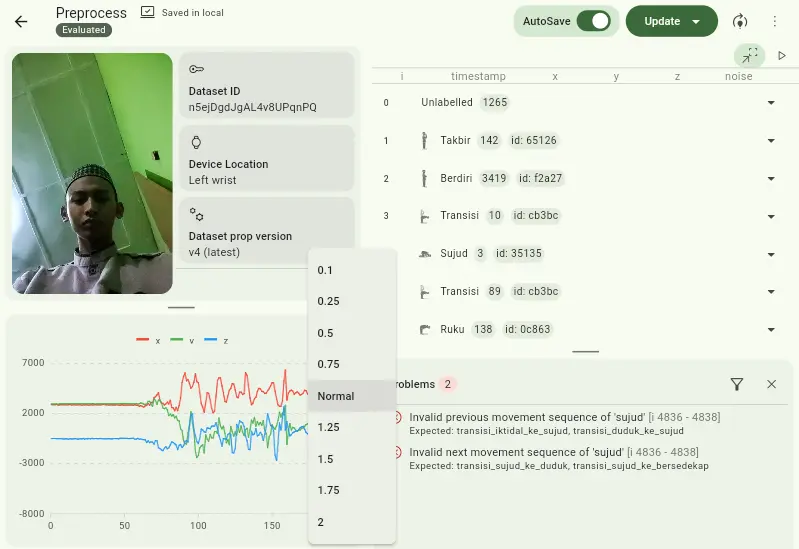
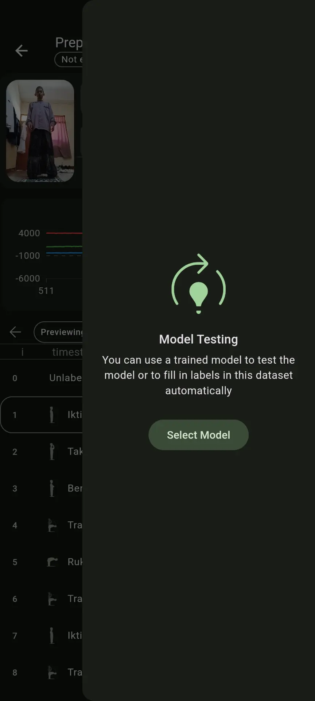
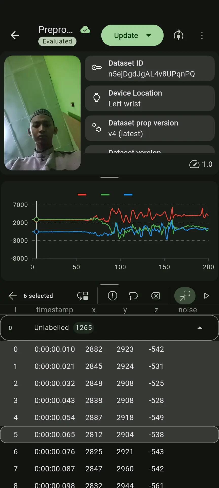
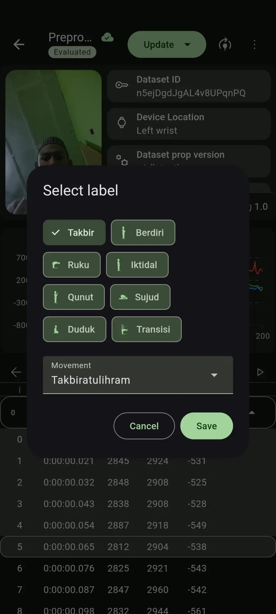
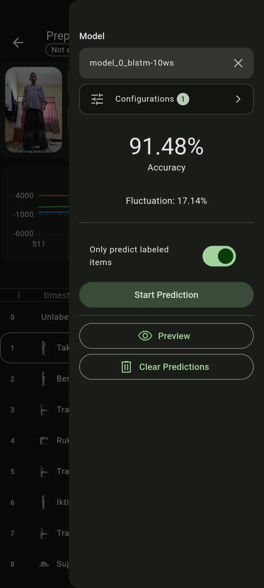
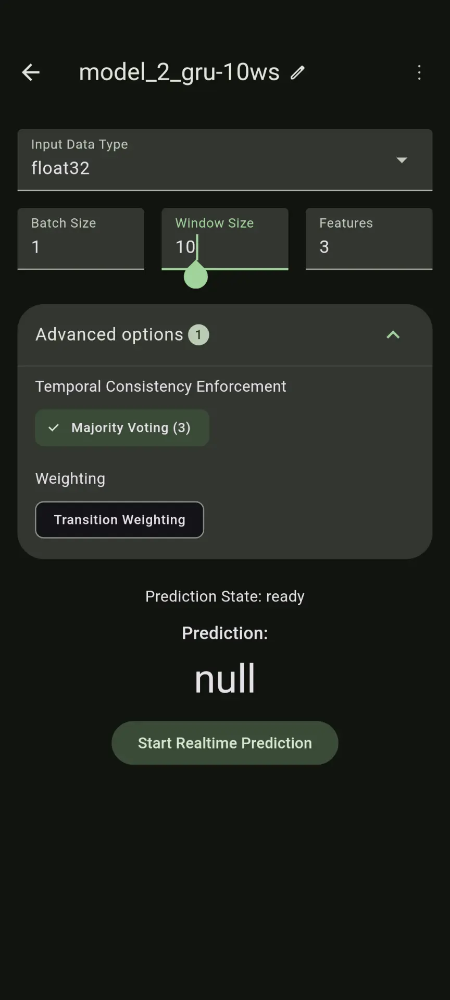
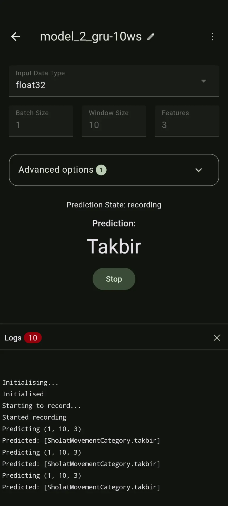

# flutter_sholat-ml

![coverage][coverage_badge]
[![style: very good analysis][very_good_analysis_badge]][very_good_analysis_link]
[![License: MIT][license_badge]][license_link]

## Abstract
The lack of wearable technology utilisation in the religious field, especially to support the practice of prayer, is the background of this research. This prompted the development of a prayer movement detection system using accelerometer data from a smartband. This research aims to apply the Recurrent Neural Network (RNN) algorithm in detecting prayer movements and evaluate its performance. Accelerometer data was collected from the Xiaomi Mi Band 5 device through the ‘sholat-ml’ application developed specifically for this study. The data was then prepared through cleaning, balancing, and data transformation stages before being used to train three RNN models, namely Bidirectional LSTM, LSTM, and GRU. The models were evaluated with various metrics across different window sizes and tested for real-time performance on a mobile phone device. The results show that the GRU model of only 89.53 KB with a window size of 30 and Majority Voting post-processing with threshold 3 provides the most optimal performance, showing an accuracy of 95.38% on real case evaluation and a fluctuation rate of 9.09% even up to 3.23% at threshold 4 surpassing the BLSTM and LSTM models.

Keywords: Prayer Movement Detection, Smartband, Accelerometer, Recurrent Neural Network (RNN), Majority Voting

## Read full paper [here](https://digilib.uinsgd.ac.id/98494/)

## A model used in this app can be found [here](https://github.com/azliR/sholat-ml)

## Getting Started 🚀

This project contains 3 flavors:

- development
- staging
- production

To run the desired flavor either use the launch configuration in VSCode/Android Studio or use the following commands:

```sh
# Development
$ flutter run --flavor development --target lib/main_development.dart

# Staging
$ flutter run --flavor staging --target lib/main_staging.dart

# Production
$ flutter run --flavor production --target lib/main_production.dart
```

## Demo

||
|--|--|
|||
|||


---


[coverage_badge]: coverage_badge.svg
[flutter_localizations_link]: https://api.flutter.dev/flutter/flutter_localizations/flutter_localizations-library.html
[internationalization_link]: https://flutter.dev/docs/development/accessibility-and-localization/internationalization
[license_badge]: https://img.shields.io/badge/license-MIT-blue.svg
[license_link]: https://opensource.org/licenses/MIT
[very_good_analysis_badge]: https://img.shields.io/badge/style-very_good_analysis-B22C89.svg
[very_good_analysis_link]: https://pub.dev/packages/very_good_analysis
[very_good_cli_link]: https://github.com/VeryGoodOpenSource/very_good_cli
